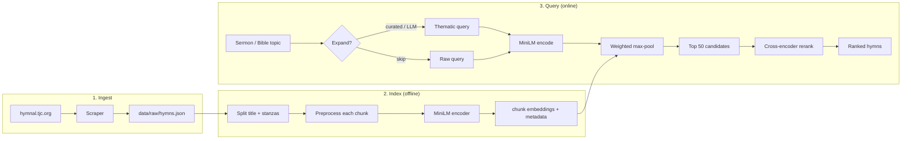
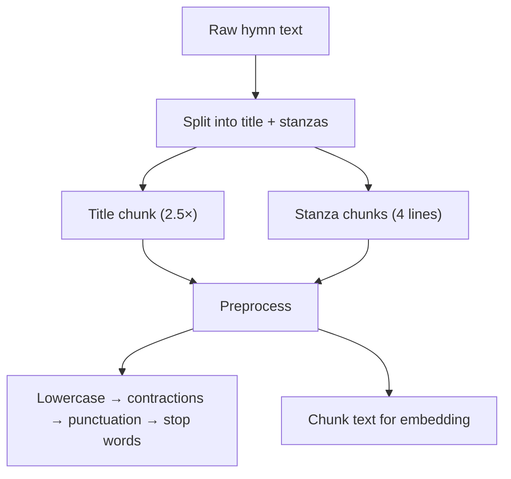
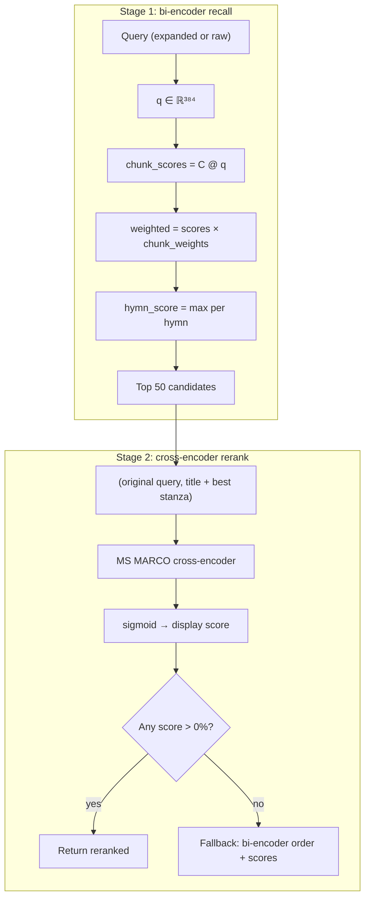

# ChoirNetwork Engine

Technical reference for the semantic hymn similarity pipeline.

## Overview

ChoirNetwork maps a **sermon title, Bible narrative, or hymn query** to thematically similar hymns in the [TJC hymnal](https://hymnal.tjc.org/hymnal-library). The engine uses **three-stage retrieval**:

1. **Query expansion** (optional) — map short topics to thematic search terms
2. **Bi-encoder recall** — encode query, score hymn chunks with weighted max-pooling
3. **Cross-encoder rerank** — re-score top ~50 candidates with joint query–document encoding

| Component | Implementation |
|-----------|----------------|
| Bi-encoder | [`all-MiniLM-L6-v2`](https://huggingface.co/sentence-transformers/all-MiniLM-L6-v2) (384-dim) |
| Cross-encoder | [`ms-marco-MiniLM-L-6-v2`](https://huggingface.co/cross-encoder/ms-marco-MiniLM-L-6-v2) |
| Query expansion | Curated topic map (27+ themes) + optional [`gpt-4o-mini`](https://platform.openai.com/docs/models/gpt-4o-mini) (validates curated themes per story) |
| Chunking | Title (2.5× weight) + 4-line stanzas |
| Similarity | Cosine (L2-normalized dot product) |
| Index | 536 hymns, 3,469 chunks, NumPy `.npy` artifacts |

## End-to-end pipeline



## Text processing

Every chunk and search query goes through the same preprocessing before bi-encoder encoding. Cross-encoder reranking uses **raw** title + best-matching stanza text.



Stanza splitting priority: blank lines → numbered stanzas → chorus markers → 4-line groups.

Implementation: `preprocess.py` (`split_lyrics_into_stanzas`, `build_hymn_chunks`).

## Two-stage retrieval



### Weighted max-pooling

```
chunk_score = cos(q, chunk) × weight     (title weight = 2.5, stanza = 1.0)
hymn_score  = max(chunk_scores for hymn)
```

### Cross-encoder reranking

- Rerank uses the **original user query** (not the expanded text) paired with each hymn's best-matching stanza
- Scores are sigmoid-normalized for display
- If all rerank scores round to 0%, fall back to bi-encoder ranking with capped scores

### Query expansion

Three-tier hybrid query understanding:

| Tier | Source | When |
|------|--------|------|
| 1 | Curated map (`query_expand.py`) | 27+ sermon/Bible topics, offline, no API |
| 2 | Curated + LLM validate (`curated+llm`) | Curated match + `CHOIRNETWORK_LLM_EXPAND=1`: LLM keeps/drops curated keywords for this story and adds a few more |
| 3 | LLM only | Unknown topics, requires `OPENAI_API_KEY` |
| 4 | Raw query | No expansion flag set |

```bash
python -m choirnetwork search "Ruth and Naomi" --expand
python -m choirnetwork search "Ruth and Naomi" --llm-expand   # curated + LLM validation
python -m choirnetwork search "obscure topic" --llm-expand      # LLM-only fallback
```

Expansion enriches the **bi-encoder** query only; cross-encoder still sees the original short query.

## Offline evaluation

Module: `eval.py` · Primary labels: `eval/datasets/service_hymns.csv`
(66 development queries, 40 held-out test queries)

| Metric | Definition |
|--------|------------|
| **Hit@k** | Fraction of queries with ≥1 relevant hymn in top *k* |
| **Recall@k** | Avg. fraction of relevant hymns retrieved in top *k* |
| **MRR@k** | Mean reciprocal rank of first relevant hymn |
| **nDCG@k** | Normalized discounted cumulative gain |

```bash
python -m choirnetwork eval --top-k 5
```

Configs compared: `bm25` → `bi_encoder_only` → `chunked_rerank` →
`chunked_rerank_expand` → `full_system`. Each neural row adds one component;
the final row adds the lyric keyword boost. BM25 uses the standard Okapi
formula over each hymn's title and lyrics (`k1=1.5`, `b=0.75`) with no
additional package.

The latest development output is in
[`eval/results/service-development.md`](../eval/results/service-development.md).
The labels are two hymns manually observed in each historical service, not
exhaustive judgments of every hymn that could fit the sermon. The evaluator
supports `--split development` and `--split test`; the test split remains
unevaluated.

## Data artifacts

```
data/
├── raw/hymns.json
├── reference/Hymn_English.pdf
└── index/
    ├── metadata.json
    ├── chunk_embeddings.npy       # (num_chunks, 384)
    ├── chunk_hymn_indices.npy
    └── chunk_weights.npy
```

Rebuild after corpus or indexing changes: `python -m choirnetwork build`

## Module map

| File | Role |
|------|------|
| `engine.py` | Two-stage retrieval, chunked index I/O |
| `bm25.py` | Classical lexical retrieval baseline |
| `preprocess.py` | NLP preprocessing, stanza splitting |
| `query_expand.py` | Curated + LLM-validated topic expansion |
| `theme_boost.py` | Lyric keyword boost during recall |
| `eval.py` | IR metrics, config comparison |
| `scraper.py` | Web corpus ingest |
| `config.py` | `.env` loading |
| `api.py` | FastAPI server + web UI (per-search AI refinement toggle) |
| `cli.py` | CLI (`scrape`, `build`, `search`, `eval`, `serve`) |

## Testing

```bash
pytest tests/    # preprocess, eval metrics, retrieval regression
```

## Known limitations

1. **No explicit hymn theme tags** — retrieval relies on lyric text, not curated metadata
2. **Cross-encoder domain gap** — MS MARCO is trained on web search, not hymns; sigmoid scores can be miscalibrated (fallback handles this)
3. **Observed selections are incomplete relevance judgments** — the two hymns
   used in a service may reflect context not stated in its sermon title, and
   other unselected hymns may still be relevant
4. **Bi-encoder scores were title-weighted** — now normalized by title weight (2.5) for display; cross-encoder sigmoid scores remain poorly calibrated for hymns

## References

- [Sentence-BERT (Reimers & Gurevych, 2019)](https://arxiv.org/abs/1908.10084)
- [all-MiniLM-L6-v2](https://huggingface.co/sentence-transformers/all-MiniLM-L6-v2)
- [MS MARCO cross-encoder](https://huggingface.co/cross-encoder/ms-marco-MiniLM-L-6-v2)
