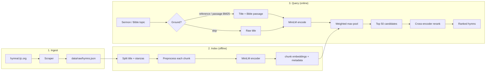

# ChoirNetwork Engine

Technical reference for the semantic hymn similarity pipeline.

## Overview

ChoirNetwork maps a **sermon title, Bible narrative, or hymn query** to thematically similar hymns in the [TJC hymnal](https://hymnal.tjc.org/hymnal-library). The engine supports:

1. **Bible grounding** (optional) — parse or retrieve a public-domain passage
2. **Bi-encoder recall** — encode query, score hymn chunks with weighted max-pooling
3. **Cross-encoder rerank** — re-score top ~50 candidates with joint query–document encoding

| Component | Implementation |
|-----------|----------------|
| Bi-encoder | [`all-MiniLM-L6-v2`](https://huggingface.co/sentence-transformers/all-MiniLM-L6-v2) (384-dim) |
| Cross-encoder | [`ms-marco-MiniLM-L-6-v2`](https://huggingface.co/cross-encoder/ms-marco-MiniLM-L-6-v2) |
| Bible grounding | Reference parser + BM25 over five-verse World English Bible windows |
| Query expansion | Curated map of 26 topics + optional [`gpt-4o-mini`](https://platform.openai.com/docs/models/gpt-4o-mini) refinement |
| Chunking | Title (2.5× weight) + 4-line stanzas |
| Similarity | Cosine (L2-normalized dot product) |
| Index | 536 hymns, 3,469 chunks, NumPy `.npy` artifacts |

## Pipeline



## Text processing

Chunk and query text is lowercased, contractions are expanded, punctuation is
removed, and stop words are dropped before embedding. Lyrics are split at
blank lines, numbered stanzas, or chorus markers. A four-line fallback is used
when the source has no stanza structure.

Implementation: `preprocess.py` (`split_lyrics_into_stanzas`, `build_hymn_chunks`).

## Two-stage retrieval

The bi-encoder scores every chunk with a dot product between normalized
embeddings. The best weighted chunk score becomes the hymn score. The top 50
hymns are passed to the cross-encoder, which scores the query against each
hymn title and its best-matching stanza.

### Weighted max-pooling

```
chunk_score = cos(q, chunk) × weight     (title weight = 2.5, stanza = 1.0)
hymn_score  = max(chunk_scores for hymn)
```

### Cross-encoder reranking

- Normal and curated searches rerank with the original title; Bible-grounded searches rerank with the grounded query
- Scores are sigmoid-normalized for display
- If all rerank scores round to 0%, fall back to bi-encoder ranking with capped scores

### Query expansion

`query_expand.py` contains an older curated topic map and an optional OpenAI
fallback. Expansion affects bi-encoder recall only; reranking still receives
the original title.

```bash
python -m choirnetwork search "Ruth and Naomi" --expand
python -m choirnetwork search "Ruth and Naomi" --llm-expand
```

### Deterministic Bible grounding

`bible_grounding.py` first parses explicit references such as `Ezra 4` or
`John 3:16`. Otherwise, it runs BM25 over overlapping five-verse windows from
the public-domain World English Bible. Coverage,
phrase overlap, and rare-term thresholds determine whether to classify the
query as a quotation or narrative; uncertain titles are classified as
abstract and left unchanged.

```bash
python -m choirnetwork search "The crises of rebuilding (Ezra 4)" --bible-ground
```

Grounded search supplies the title-plus-passage text to both recall and
reranking. It cannot be combined with curated or LLM expansion. The grounder
only reads the sermon title and Bible corpus.

## Data artifacts

```
data/
├── public/world_english_bible.json   # public-domain, checked in
├── raw/hymns.json                    # copyrighted/local
├── reference/Hymn_English.pdf        # copyrighted/local
└── index/
    ├── metadata.json
    ├── chunk_embeddings.npy       # (num_chunks, 384)
    ├── chunk_hymn_indices.npy
    └── chunk_weights.npy
```

Rebuild after corpus or indexing changes: `python -m choirnetwork build`

## Module map

| File | Role |
|------|------|
| `engine.py` | Two-stage retrieval, chunked index I/O |
| `bible_grounding.py` | Deterministic references, passage BM25, and abstention |
| `bm25.py` | Classical lexical retrieval baseline |
| `preprocess.py` | NLP preprocessing, stanza splitting |
| `query_expand.py` | Curated + LLM-validated topic expansion |
| `theme_boost.py` | Lyric keyword boost during recall |
| `eval.py` | IR metrics, config comparison |
| `scraper.py` | Web corpus ingest |
| `config.py` | `.env` loading |
| `api.py` | FastAPI server and web UI |
| `cli.py` | CLI (`scrape`, `build`, `search`, `eval`, `serve`) |

## Testing

```bash
pytest tests/    # preprocess, eval metrics, retrieval regression
```

## Known limitations

1. **No explicit hymn theme tags** — retrieval relies on lyric text, not curated metadata
2. **Cross-encoder domain gap** — MS MARCO is trained on web search, not hymns; sigmoid scores can be miscalibrated (fallback handles this)
3. **Bi-encoder scores are title-weighted** — they are normalized by the 2.5×
   title weight for display; cross-encoder scores remain poorly calibrated for
   this domain
4. **Automatic Bible grounding is ambiguous** — abstract titles can retrieve
   lexically similar but unrelated passages, so grounding is opt-in

## References

- [Sentence-BERT (Reimers & Gurevych, 2019)](https://arxiv.org/abs/1908.10084)
- [all-MiniLM-L6-v2](https://huggingface.co/sentence-transformers/all-MiniLM-L6-v2)
- [MS MARCO cross-encoder](https://huggingface.co/cross-encoder/ms-marco-MiniLM-L-6-v2)
- [World English Bible](https://ebible.org/engwebp/) (Public Domain)
